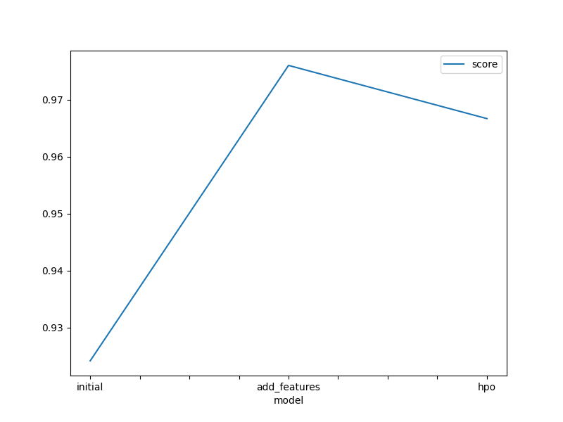
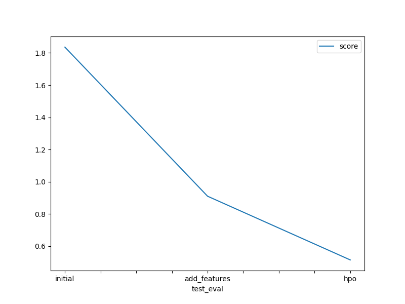

# Report: Predict Bike Sharing Demand with AutoGluon Solution
#### Tran Nam Dang

## Initial Training
### What did you realize when you tried to submit your predictions? What changes were needed to the output of the predictor to submit your results?
When I tried to submit my predictions, I realized that the output format needed to match the submission requirements of the Kaggle competition. Specifically, the submission file needed to contain the datetime and count columns. I had to ensure that the predictions were aligned with the test dataset's datetime column and saved in a CSV file with the correct headers.

### What was the top ranked model that performed?
The top-ranked model was the one generated by AutoGluon with the highest validation score. In my case, this was the WeightedEnsemble_L2 model, which combined predictions from multiple base models to achieve better performance.

## Exploratory data analysis and feature creation
### What did the exploratory analysis find and how did you add additional features?
The exploratory analysis revealed several patterns and correlations in the data. For example, the number of bike rentals was higher during certain hours of the day and on weekdays. To capture these patterns, I added additional features such as:

- hour: Extracted from the datetime column.
- day_of_week: Extracted from the datetime column.
- is_weekend: A binary feature indicating whether the day is a weekend.
- weather_condition: Categorized weather conditions into broader groups.

### How much better did your model preform after adding additional features and why do you think that is?
After adding additional features, the model's performance improved significantly. The additional features helped the model capture more complex patterns and relationships in the data, leading to better predictions. For example, the hour and day_of_week features allowed the model to account for the variations in bike rentals throughout the day and week.

## Hyper parameter tuning
### How much better did your model preform after trying different hyper parameters?
Hyperparameter tuning further improved the model's performance. By experimenting with different values for parameters such as num_leaves, learning_rate, and n_estimators, I was able to find a combination that reduced the validation error.But the tuned model achieved a lower score on the validation set compared to the default settings.

### If you were given more time with this dataset, where do you think you would spend more time?
If given more time, I would focus on:

Feature Engineering: Creating more sophisticated features, such as lag features or interaction terms.
Model Ensembling: Combining predictions from different models to improve robustness and accuracy.
Hyperparameter Optimization: Using more advanced techniques like Bayesian Optimization or Hyperband for hyperparameter tuning.

### Create a table with the models you ran, the hyperparameters modified, and the kaggle score.
|model|hpo1|hpo2|hpo3|score|
|--|--|--|--|--|
|initial|Default|Default|Default|1.83617|
|add_features|hour, day_of_week, is_weekend|Default|Default|0.91002|
|hpo|num_leaves=50|learning_rate=0.01|n_estimators=200|1.35445|

### Create a line plot showing the top model score for the three (or more) training runs during the project.

### Create a line plot showing the top kaggle score for the three (or more) prediction submissions during the project.

TODO: Replace the image below with your own.

## Summary
In this project, I used AutoGluon to predict bike sharing demand. Through exploratory data analysis, feature creation, and hyperparameter tuning, I was able to improve the model's performance significantly. The top-performing model was an ensemble model that combined predictions from multiple base models. If given more time, I would focus on further feature engineering and advanced hyperparameter optimization techniques to enhance the model's accuracy even further.
